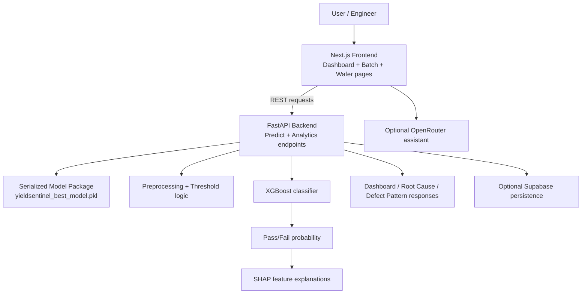

# Architecture

## Overview

The implemented architecture is a lightweight full-stack application for wafer-yield analysis. The project is divided into a Python backend for inference and analytics and a Next.js frontend for interactive review. The trained model and preprocessing pipeline are serialized into a package so the service can run locally without retraining for normal use.

## Components

| Component | Technology in this repository | Responsibility |
|---|---|---|
| Frontend application | Next.js, React, Tailwind CSS, Framer Motion | Presents dashboard pages, wafer views, batch analysis, risk summaries, and corrective-action workflows |
| Backend API | FastAPI, Python, pandas, NumPy, joblib, SHAP | Validates inputs, aligns sensor features, runs inference, calculates SHAP explanations, and exposes analytics endpoints |
| Model package | XGBoost model artifact plus imputer and metadata | Stores the trained classifier, threshold, feature names, and preprocessing configuration |
| Training pipeline | Python notebook and `train_model.py` | Builds the model from the SECOM-style data and exports the model bundle |
| Optional persistence | Supabase client integration | Writes prediction and batch results when credentials are configured |
| Optional AI helper | OpenRouter integration in the frontend API route | Provides an optional conversational assistant when an API key is configured |

## Data Flow

1. A user opens the Next.js dashboard and either selects a wafer record or uploads a CSV batch file.
2. The frontend sends requests to the FastAPI backend at `http://localhost:8000`.
3. The backend loads the model bundle from `src/backend/yieldsentinel_best_model.pkl` and applies the stored feature schema and imputation logic.
4. The model computes pass/fail probabilities for each wafer and assigns a prediction using the configured threshold.
5. SHAP is used to rank the strongest feature contributors for the predicted risk.
6. The backend returns structured data to the frontend for dashboard summaries, root-cause views, defect-pattern summaries, and batch-risk analysis.
7. If configured, the frontend chat route can query OpenRouter for operational assistance using the latest batch analysis summary.

## Mermaid Architecture Diagram

## Operational Notes

- The backend is stateless for the core inference flow; it loads the model on startup and responds to requests.
- The batch analytics endpoints depend on the most recently uploaded CSV analysis stored in memory during the running session.
- The optional AI assistant and Supabase persistence are support features, not required for the main prediction workflow.
- The project is designed as a local prototype and is not a large-scale production deployment stack.

## Security and Practical Considerations

- Secrets such as API keys should be kept in environment files and never committed to the repository.
- The frontend chat route works only when `OPENROUTER_API_KEY` is configured.
- Local CORS is enabled in the FastAPI backend for development use; it is not an enterprise-grade security layer.

## Scalability Notes

This solution is intentionally lightweight and suitable for a hackathon proof-of-concept. The backend could be extended to support more production-ready inputs, a more robust manufacturing data store, and a more comprehensive analytics pipeline, but the current implementation remains focused on local, explainable wafer-risk analysis from the available dataset and repository code.
