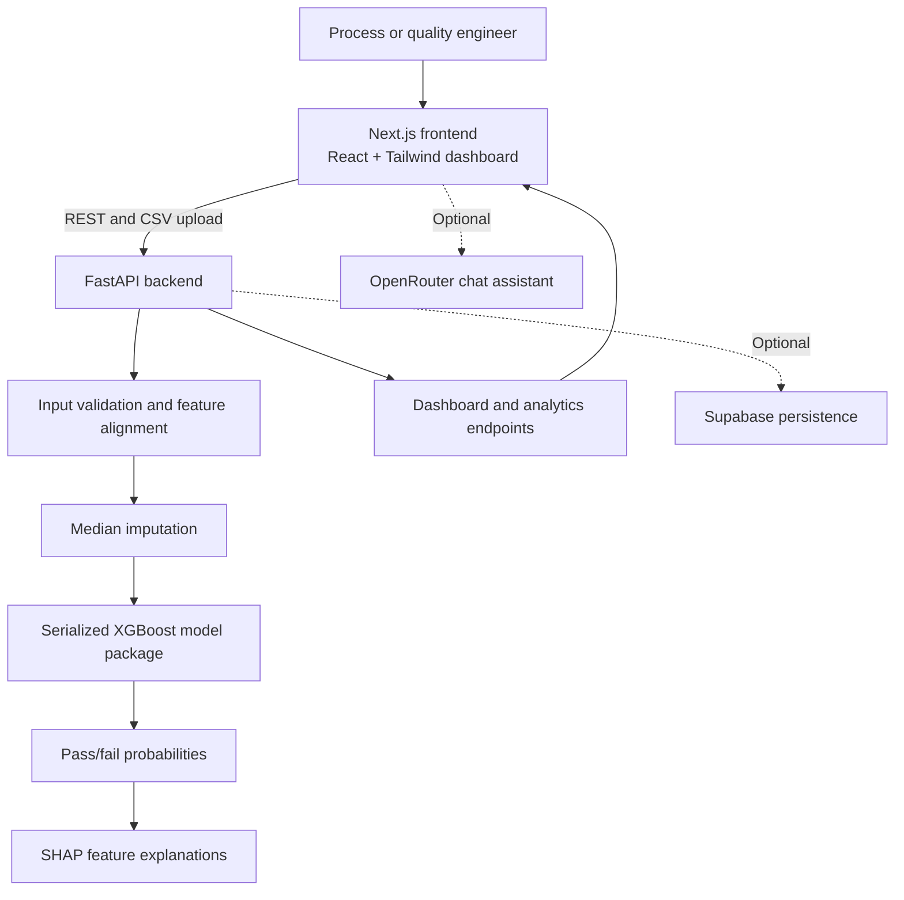

# Architecture

## System Architecture

YieldSentinel AI is a full-stack wafer-yield analysis application. A Next.js frontend provides the dashboard and sends REST requests to a FastAPI backend. The backend loads a serialized XGBoost model package, aligns incoming sensor data to the trained feature schema, imputes missing values, calculates pass/fail probabilities, and produces SHAP-based explanations. Optional Supabase persistence and an OpenRouter chat assistant extend the core workflow when their credentials are configured.

## Components

| Component | Technology | Responsibility |
|---|---|---|
| Frontend | Next.js, React, TypeScript, Tailwind CSS, Framer Motion | Provides dashboard pages for wafer scoring, batch risk, process review, root-cause analysis, defect patterns, and corrective actions. |
| Backend API | FastAPI, Python, Pydantic | Exposes health, model-info, single-wafer prediction, batch CSV prediction, dashboard, root-cause, and defect-pattern endpoints. |
| Machine learning | XGBoost, scikit-learn, pandas, NumPy | Classifies wafer outcomes using the trained feature set and preprocessing configuration. |
| Explainability | SHAP | Ranks the strongest feature contributions for a prediction and indicates whether they push toward PASS or FAIL. |
| Model artifact | joblib serialized package | Stores the trained model, feature names, imputer, target metadata, and prediction threshold used by the API. |
| Training pipeline | Python notebook, `train_model.py`, SECOM-style CSV dataset | Trains and evaluates the model and exports the model package used for inference. |
| Optional persistence | Supabase | Stores prediction and batch results when Supabase environment variables are configured. |
| Optional assistant | Next.js API route, OpenRouter | Provides conversational assistance based on the latest analysis when an OpenRouter API key is configured. |

## Data Flow

1. An engineer opens the Next.js dashboard and enters sensor values for one wafer or selects a CSV file containing multiple wafer records.
2. The frontend sends a JSON request to `/predict` or a multipart file request to `/predict-csv` on the FastAPI backend.
3. The backend validates the request and aligns the supplied columns with the feature names stored in `yieldsentinel_best_model.pkl`.
4. Missing sensor values are filled using the median imputer saved in the model package.
5. The XGBoost model calculates PASS and FAIL probabilities. The configured threshold determines the final wafer prediction and anomaly score.
6. For single-wafer predictions, SHAP calculates and ranks the strongest feature contributors behind the result.
7. The backend returns structured prediction, batch, dashboard, root-cause, and defect-pattern data to the frontend.
8. The dashboard renders risk summaries and investigation views. When configured, prediction and batch results are also written to Supabase, and the chat route can request assistance from OpenRouter.

## Security Considerations

- API keys and Supabase credentials must be stored in environment variables and must not be committed to the repository.
- The OpenRouter assistant is disabled unless `OPENROUTER_API_KEY` is configured.
- Supabase persistence is optional and degrades gracefully when database credentials are unavailable.
- The backend validates request bodies with Pydantic and validates uploaded CSV content before inference.
- CORS is currently permissive for local development. A production deployment should restrict `allow_origins` to the deployed frontend domain.
- The serialized model artifact is loaded from a configured local path. Only trusted model files should be deployed because joblib deserialization is not suitable for untrusted input.

## Scalability Notes

The core FastAPI inference service is stateless apart from the latest in-memory batch analysis, so it could be horizontally scaled behind a load balancer after moving batch state and prediction history to shared storage. A production version could add a managed database, asynchronous batch jobs, object storage for uploaded CSV files, authentication, rate limiting, and model-version tracking. Model inference could also be moved to workers for large uploads, while the Next.js frontend could be deployed independently behind a CDN.
